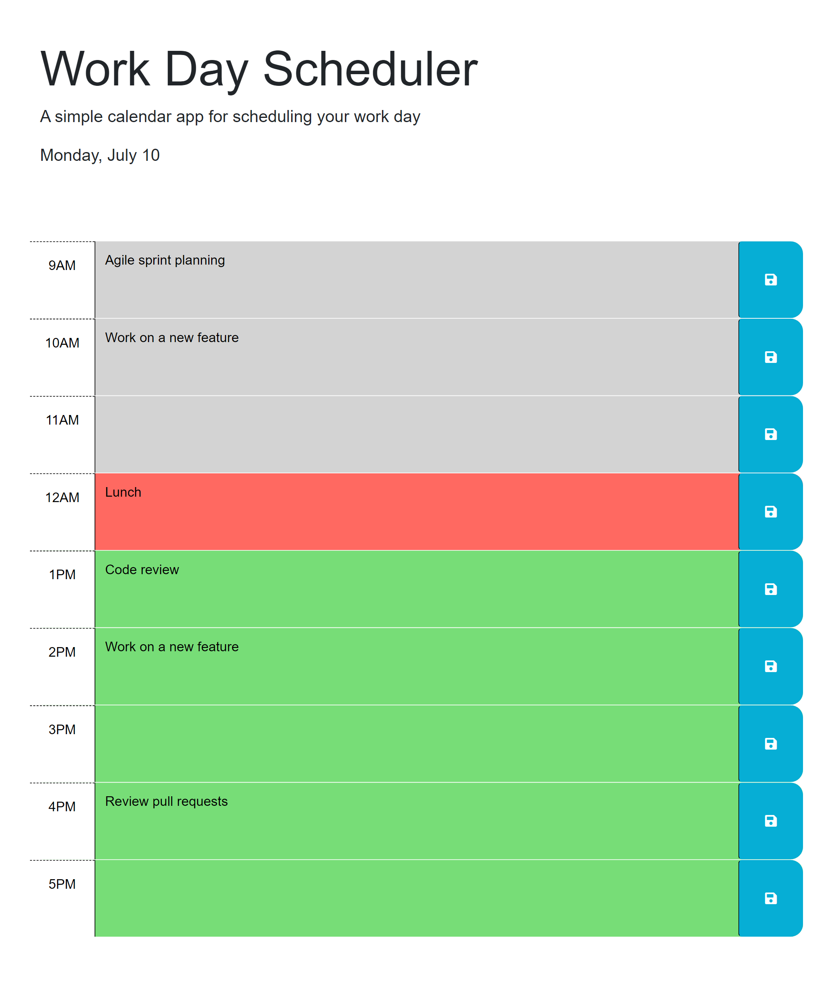

# Work Day Scheduler

## Description

This website allows you the schedule your workday with hourly time blocks. Each time block will communicate whether it is past, present, or future and can be saved to local storage.

## Usage

Visit the live site [here](https://gormanbrian.github.io/work-day-scheduler/)

## Attribution

- [Source code](https://github.com/coding-boot-camp/crispy-octo-meme)

## Screenshots

